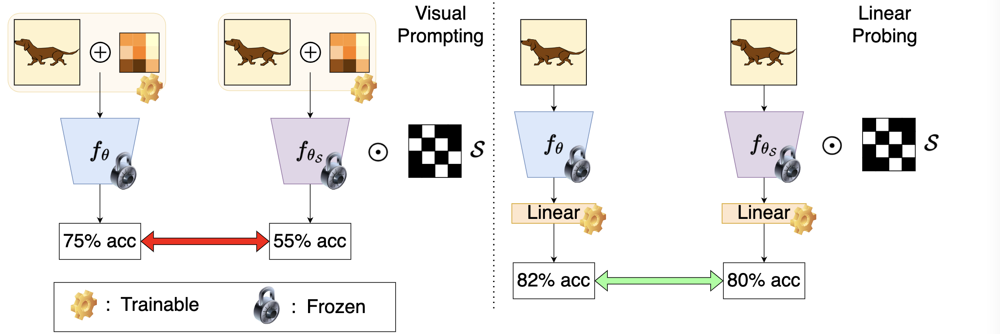

# Reprogramming Under Constraints

> Diganta Misra*, Agam Goyal*, Bharat Runwal*, Pin-Yu Chen

In the era of foundation models with huge pre-training budgets, the downstream tasks have been shifted to the narrative of efficient and fast adaptation. For classification-based tasks in the domain of computer vision, the two most efficient approaches have been **linear probing** (LP) and **visual prompting**/**reprogramming** (VP); the former aims to learn a classifier in the form of a linear head on the features extracted by the pre-trained model, while the latter maps the input data to the domain of the source data on which the model was originally pre-trained on. Although extensive studies have demonstrated the differences between LP and VP in terms of downstream performance, we explore the capabilities of the two aforementioned methods via the sparsity axis: (a) **Data sparsity**: the impact of few-shot adaptation and (b) **Model sparsity**: the impact of lottery tickets (LT). We demonstrate that <u>LT</u> are not universal reprogrammers, i.e., for certain target datasets, reprogramming an LT yields significantly lower performance than the reprogrammed dense model although their corresponding upstream performance is similar. Further, we demonstrate that the calibration of dense models is always superior to that of their lottery ticket counterparts under both LP and VP regimes. Our empirical study opens a new avenue of research into VP for sparse models and encourages further understanding of the performance beyond the accuracy achieved by VP under constraints of sparsity. Code and logs can be accessed at [https://github.com/landskape-ai/ILM-VP](https://github.com/landskape-ai/Reprogram_LT) and [https://wandb.ai/landskape/Reprogram-Sparse](https://wandb.ai/landskape/Reprogram-Sparse) respectively.



## What is in this repository?

In this repository, we provide the code for our Reprogramming Under Constraints paper.

## Dependencies

Run `pip3 install -r requirements.txt`.

## Run the scripts

### Transferring a dense model

To run the Linear Probing script to transfer the dense model onto the full CIFAR-10 dataset with default parameters, use the following command:

```
python3 experiments/cnn/linear_probing.py \
        --network dense \
        --n_shot -1 \
        --batch_size 128 \
        --dataset cifar10 \
        --results_path results \
```

Note that `n_shot = -1` indicated that the entire data is being used. To use other N-shot data budgets, the user can provide a custon value.

Similarly, to run the ILM-VP script to transfer the dense model onto the full CIFAR-10 dataset with default parameters, use the following command:

```
python3 experiments/cnn/ilm_vp.py \
        --network dense \
        --n_shot -1 \
        --batch_size 128 \
        --dataset cifar10 \
        --results_path results \
```

### Transferring a Lottery Ticket

To run the Linear Probing script to transfer lottery ticket at sparsity state `8` onto the full CIFAR-10 dataset with default parameters, use the following command:

```
python3 experiments/cnn/linear_probing.py \
        --network LT \
        --sparsity 8 \
        --pretrained_dir pretrained_dir_name \
        --n_shot -1 \
        --batch_size 128 \
        --dataset cifar10 \
        --results_path results \
```

Note that `n_shot = -1` indicated that the entire data is being used. To use other N-shot data budgets, the user can provide a custon value.

Similarly, to run the ILM-VP script to transfer lottery ticket at sparsity state `8` onto the full CIFAR-10 dataset with default parameters, use the following command:

```
python3 experiments/cnn/ilm_vp.py \
        --network LT \
        --sparsity 8 \
        --pretrained_dir pretrained_dir_name \
        --n_shot -1 \
        --batch_size 128 \
        --dataset cifar10 \
        --results_path results \
```


**Note:** The ResNet-50 lottery ticket checkpoints pretrained on ImageNet-1k used in this study may be made available upon reasonable request from the authors.